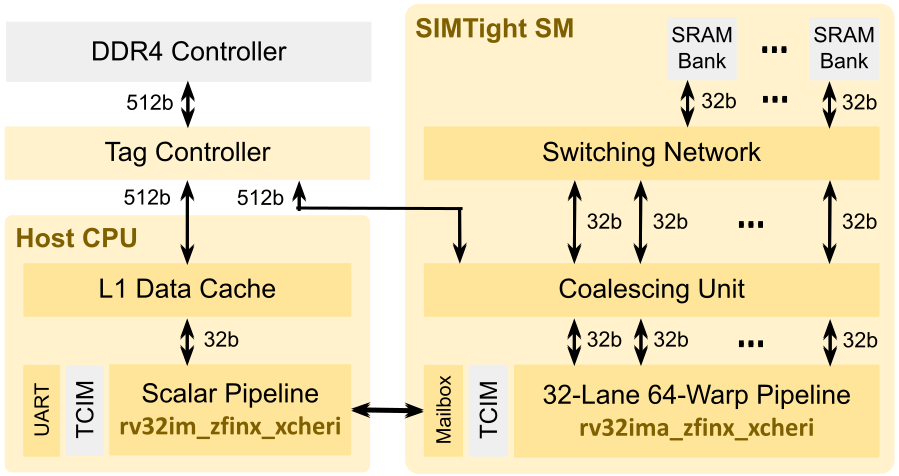

# SIMTight

SIMTight is a prototype GPGPU being developed on the [CAPcelerate
project](https://gow.epsrc.ukri.org/NGBOViewGrant.aspx?GrantRef=EP/V000381/1)
to explore the use of [CHERI capabilities](http://cheri-cpu.org) in
SIMT-style accelerators popularised by NVIDIA and AMD.
The SIMTight SoC consists of a scalar CPU and a 32-lane 64-warp GPGPU
sharing DRAM, both supporting the CHERI-RISC-V ISA.



The SoC is optimised for high performance density on FPGA (MIPS per
LUT).  A sample project is provided for the
[DE10-Pro](http://de10-pro.terasic.com) development board.  There is
also a [CUDA-like C++ library](soc/SIMTight/inc/NoCL.h) and a set of
sample [compute kernels](soc/SIMTight/apps/) ported to this library.
When CHERI is enabled, the kernels run in pure capability mode.
The SoC is implemented in Haskell using the
[Blarney](https://github.com/blarney-lang/blarney) hardware
description library and the
[Pebbles](//github.com/blarney-lang/pebbles) RISC-V processor
framework.

## Build instructions

We'll need Verilator, a RISC-V compiler, and a fairly recent version
of GHC (8.6.1 or later).

On Ubuntu 20.04, we can simply do:

```sh
$ sudo apt install verilator
$ sudo apt install gcc-riscv64-unknown-elf
$ sudo apt install ghc-8.6.5
```

Now, we recursively clone the repo:

```sh
$ git clone --recursive https://github.com/CTSRD-CHERI/SIMTight
```

Inside the repo, there are various things to try.  For example, to
build and run the SIMTight simulator:

```sh
$ cd sim
$ make
$ ./sim
```

While the simulator is running, we can build and run the test suite
in a separate terminal:

```sh
$ cd apps/TestSuite
$ make test-cpu-sim     # Run on the CPU
$ make test-simt-sim    # Run on the SIMT core
```

Alternatively, we can run one of the SIMT kernels:

```sh
$ cd apps/Histogram
$ make RunSim
$ ./RunSim
```

To run all tests and benchmarks, we can use the test script.  This
script will launch the simulator automatically, so we first make sure
it's not already running.

```sh
$ killall sim
$ cd test
$ ./test.sh            # Run in simulation
```

To build an FPGA image (for the
[DE10-Pro](http://de10-pro.terasic.com) board):

```sh
$ cd de10-pro
$ make                 # Assumes quartus is in your PATH
$ make download-sof    # Assumes DE10-Pro is connected via USB
```

We can now run a SIMT kernel on FPGA:

```sh
$ cd apps/Histogram
$ make Run
$ ./Run
```

To run the test suite and all benchmarks on FPGA:

```sh
$ cd test
$ ./test.sh --fpga     # Assumes FPGA image built and FPGA connected via USB
```

When running on FPGA, performance stats are also emitted.

## Enabling CHERI :cherries:

To enable CHERI, some additional preparation is required.  First, edit
[inc/Config.h](inc/Config.h) and apply the following settings:

  * `#define EnableCHERI 1`
  * `#define EnableTaggedMem 1`
  * `#define UseClang 1`

Second, install the CHERI-Clang compiler using
[cheribuild](https://github.com/CTSRD-CHERI/cheribuild).  Assuming all
of [cheribuild's
dependencies](https://github.com/CTSRD-CHERI/cheribuild#pre-build-setup)
are met, we can simply do:

```sh
$ git clone https://github.com/CTSRD-CHERI/cheribuild
$ cd cheribuild
$ ./cheribuild.py sdk-riscv64-purecap
```

Note that a clean build on or after 19 Aug 2021 is required.  By
default, this will install the compiler into `~/cheri/`.  We then need
to add the compiler to our `PATH`:

```sh
export PATH=~/cheri/output/sdk/bin:$PATH
```

We musn't forget to `make clean` in the root of the SIMTight repo any
time [inc/Config.h](inc/Config.h) is changed.  At this point, all of
the standard build instructions should work as before.
